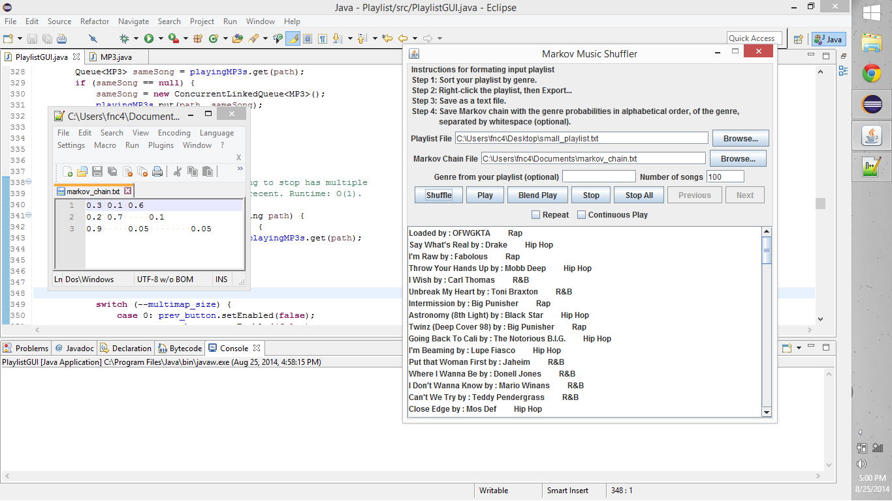

# Markov Music Shuffler

This creates a music shuffle based on a Markov chain over the genres.
I utilize the
<a href="http://www.javazoom.net/javalayer/sources.html">JLayer MP3 library</a>
in order to play the MP3s; more on this can be seen in the MP3.java file.

## What it Should Look Like

## Buttons and Fields

* Browse: Allows you to find/use exported playlist, or Markov chain file.
* Enter genre (optional): Allows you to input genre to begin Markov chain.
* Number of songs: Number of songs to display in the shuffle.
* Shuffle: Creates a shuffle based on a Markov chain.
* Play: Plays the selected song. If other songs are currently playing, they are stopped.
* Blend Play: Same as play except, any playing songs are not stopped.
* Stop: Stops the selected song.
* Stop All: Stops all currently playing songs.
